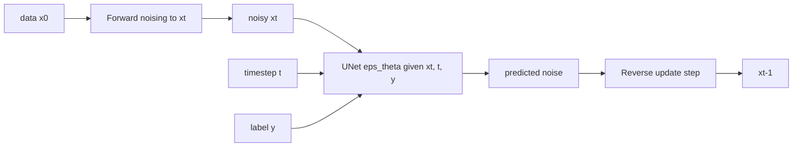

````md
# CS-810 Final Project — VAE vs DDPM on MNIST

**Title:** Comparing Variational and Diffusion Paradigms for Image Generation: An Empirical Study on MNIST  
**Course:** CS-810 Probabilistic Generative Modeling and Learning  
**Repo:** https://github.com/vidhikansara12/CS810_Project

This project compares two probabilistic generative modeling paradigms on MNIST:

- **Class-conditional VAE** (ELBO / explicit latent space / fast sampling)
- **Class-conditional DDPM** (iterative denoising / slower sampling / quality depends strongly on number of steps)

Because MNIST is 28×28 (where standard FID can be unstable/uninformative), evaluation uses MNIST-appropriate proxies:
- **LeNet intended-label accuracy (↑):** how often a pretrained LeNet predicts the intended conditioning label on generated samples
- **LeNet feature-space Fréchet distance (↓):** FID-like distance computed in LeNet’s penultimate-layer feature space

---

## Key Results (10,000 generated samples per run; 1,000 per class)

| Model | Setting | LeNet-Acc (↑) | Feature Fréchet (↓) |
| --- | --- | ---: | ---: |
| VAE | β = 1.0 | 0.9265 | 322.7347 |
| VAE | β = 0.5 | 0.8360 | 392.0502 |
| DDPM | T = 100 | 0.2976 | 673.3708 |
| DDPM | T = 400 | 0.9171 | 51.6656 |

**Main takeaway:** Diffusion shows a strong compute–quality tradeoff: increasing sampling steps from **T=100 → T=400** massively improves both feature alignment and class-consistency. VAEs sample quickly and produce coherent digits, but (in this setup) do not match the best diffusion run in feature-space realism.

---

## Repository Layout

```text
.
├── src/                      # model code (VAE, DDPM, UNet, LeNet)
│   └── models/
├── checkpoints/              # trained weights (*.pt)
├── results/
│   ├── samples/              # sample grids + recon grids saved during training
│   ├── metrics/              # metrics.csv, table_metrics.csv, cached real stats, eval tensors
│   └── figures/              # paper-ready plots + montage
├── notebooks/                # training/eval notebooks (Colab-friendly)
├── report/                   # final report PDF
├── train_lenet.py
├── train_vae.py
├── train_ddpm.py
├── sample_vae.py
├── sample_ddpm.py
├── generate_eval_samples.py
├── eval_metrics.py
├── make_figures.py
├── requirements.txt
└── README.md
````

> This repo is designed so outputs live **inside the repo** (`./checkpoints`, `./results`) for easy sharing and grading.

---

## Architecture (high level)

### End-to-end pipeline

```mermaid
flowchart TD
  A[MNIST] --> B[Train LeNet]
  A --> C[Train VAE]
  A --> D[Train DDPM]
  C --> E[Save VAE grids]
  D --> F[Save DDPM grids]
  C --> G[Gen eval samples]
  D --> G
  B --> H[Compute metrics]
  G --> H
  H --> I[Write CSV]
  I --> J[Make plots]
  E --> K[Make montage]
  F --> K
  J --> L[Figures]
  K --> M[Montage]

### Model diagrams

#### Conditional VAE (β-ELBO)

```mermaid
flowchart LR
  x[image x] --> Enc[Encoder q_phi of z given x and y]
  y[label y] --> Enc
  Enc --> z[latent z]
  z --> Dec[Decoder p_theta of x given z and y]
  y --> Dec
  Dec --> xhat[reconstruction or sample]
```

#### Conditional DDPM (noise prediction)




---

## Reproduce everything via scripts 

### 1) Train LeNet evaluator

```bash
python train_lenet.py --epochs 5 --out_root .
```

### 2) Train VAE (β ablation)

```bash
python train_vae.py --run_name vae_beta1  --beta 1.0 --epochs 20 --out_root .
python train_vae.py --run_name vae_beta05 --beta 0.5 --epochs 20 --out_root .
```

### 3) Train DDPM (T ablation)

```bash
python train_ddpm.py --run_name ddpm_T100 --T 100 --epochs 10 --out_root .
python train_ddpm.py --run_name ddpm_T400 --T 400 --epochs 5  --out_root .
```

### 4) Generate standardized eval sets (10k per run) + compute metrics

```bash
python generate_eval_samples.py --out_root . --n_per_class 1000
python eval_metrics.py --out_root .
```

### 5) Export paper figures

```bash
python make_figures.py --metrics_csv ./results/metrics/metrics.csv --out_dir ./results/figures
```

### 6) Build the 2×2 samples montage

If you have a montage script/notebook cell, it writes:

* `results/figures/fig_samples_montage.png`

---

## Outputs

### Figures

* `results/figures/fig_samples_montage.png` — 2×2 qualitative comparison
* `results/figures/fig_lenet_acc.png` — intended-label accuracy bar chart
* `results/figures/fig_feature_frechet.png` — feature Fréchet bar chart

### Metrics

* `results/metrics/metrics.csv` — main metrics table
* `results/metrics/table_metrics.csv` — cleaned version for report tables
* `results/metrics/real_test_stats.npz` — cached real MNIST feature stats (LeNet)

### Checkpoints

* `checkpoints/lenet.pt`
* `checkpoints/vae_beta1.pt`, `checkpoints/vae_beta05.pt`
* `checkpoints/ddpm_T100.pt`, `checkpoints/ddpm_T400.pt`

---

## Metrics (what do they mean)

### 1) Intended-label accuracy (↑)

Generate conditional samples using label `y`. Classify generated images using LeNet and compute:

* accuracy = fraction of predictions equal to the intended label

This measures **class-consistency** of conditional generation.

### 2) Feature-space Fréchet distance (↓)

Let `f(·)` be the LeNet penultimate-layer feature extractor. Compute `(μ_r, Σ_r)` on real MNIST test features and `(μ_g, Σ_g)` on generated features, then compute:

```text
d^2 = ||mu_r - mu_g||^2 + Tr( Sigma_r + Sigma_g - 2 * (Sigma_r Sigma_g)^(1/2) )

Lower indicates generated samples are closer to real MNIST in this task-relevant embedding.

---

